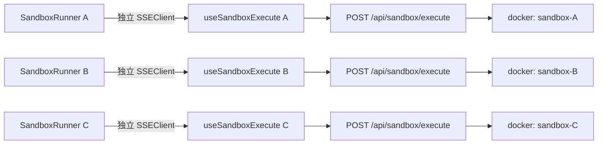
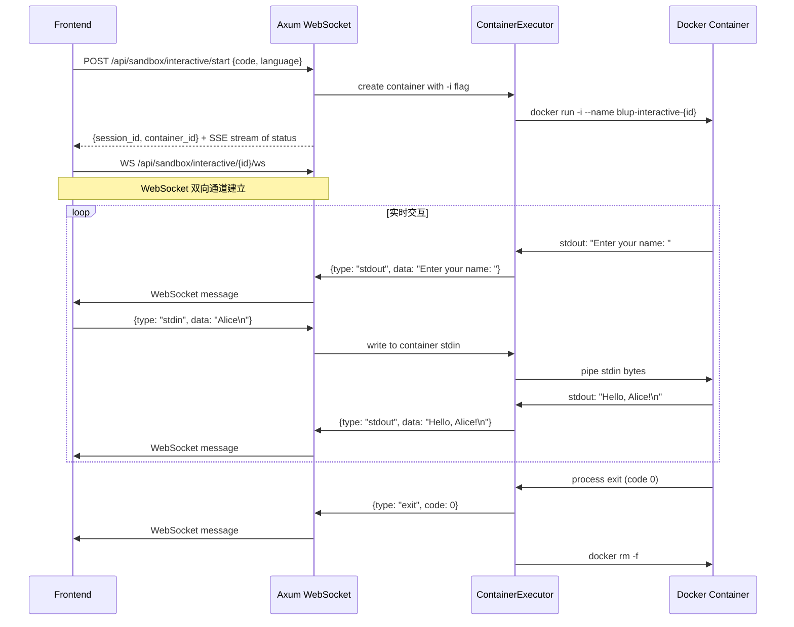
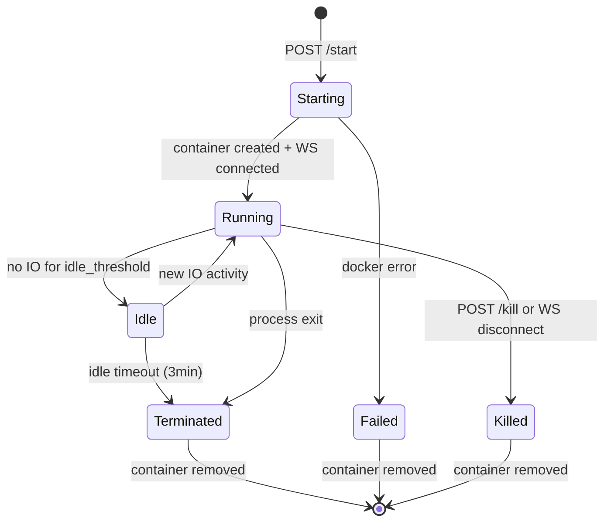
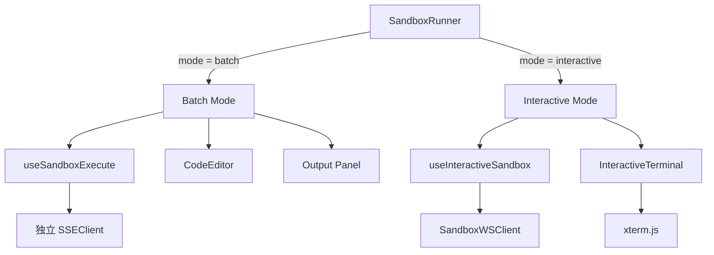

# Plan: 多代码块并行运行 + 交互式终端 (WebSocket)

## 目标

为沙盒代码执行系统增加两项能力：

1. **多代码块并行运行**：页面上多个 `SandboxRunner` 实例可以同时执行代码，互不干扰，且正确释放资源避免内存泄漏。
2. **交互式终端**：通过 WebSocket 建立 Docker 容器的双向通信通道，支持 `input()` 等需要用户实时输入的程序交互。

## 现状分析

### 当前执行链路

```
SandboxRunner (前端)
  → useSandboxExecute hook
    → SSEClient (全局单例).connectPost(POST /api/sandbox/execute)
      → agent-core handler (SSE stream)
        → ContainerExecutor.execute()
          → docker run <image> python -c "code"  ← 非交互，代码作为 CLI 参数
          → 收集 stdout/stderr 后一次性返回
```

### 问题 1：全局 SSEClient 阻塞并行

`useSandboxExecute` 中 `sseRef = useRef(sseClient)` 使用全局单例。当第 2 个 SandboxRunner 调用 `execute` 时，`sseRef.current.close()` 会关闭第 1 个仍在运行的 SSE 连接，导致第一个代码块的输出被截断。

### 问题 2：无法交互式输入

- Interpreted 语言（Python/Node）使用 `docker run image python -c "code"` 模式，代码作为 CLI 参数传入，进程 stdin 没有连接。
- 即使 `SandboxRequest` 有 `stdin` 字段，`ContainerExecutor` 的 Interpreted 分支也没有将 stdin 数据传入容器。
- 容器执行 `.output()` 一次性收集结果后立即销毁，无法支持来回交互。

## 第一部分：多代码块并行运行

### 设计

每个 `useSandboxExecute` hook 实例创建独立的 `SSEClient`，而不是共享全局单例。组件卸载时通过 cleanup 函数关闭 SSE 连接，防止内存泄漏。



### 改动清单

| 文件 | 改动 |
|------|------|
| `apps/web-ui/src/hooks/query.ts` | `useSandboxExecute` 中 `useRef(sseClient)` → `useRef(new SSEClient())` |

### 内存泄漏防护

当前代码已有 cleanup 逻辑：

```typescript
useEffect(() => {
  const client = sseRef.current;
  return () => { client.close(); };  // 组件卸载时关闭连接
}, []);
```

改为独立实例后，这个 cleanup 正确关闭该实例自己的 SSEClient，不会影响其他并行实例。`SSEClient.close()` 会清理 `EventSource`、`AbortController` 和 reconnect timer，无残留。

### 后端改动

无。后端每次请求创建独立的 Docker 容器（`blup-sandbox-{uuid}`），天然并行。

---

## 第二部分：交互式终端 (WebSocket)

### 架构概览

引入 WebSocket 双向通道替代 SSE 单向流。后端启动 `docker run -i` 保持容器 stdin 开放，通过 WebSocket 实时转发 stdin/stdout。



### 容器生命周期状态机



### API 契约

#### 1. 启动交互式容器

```
POST /api/sandbox/interactive/start
Content-Type: application/json

Request:
{
  "session_id": "uuid",
  "language": "python",
  "code": "name = input('Enter your name: ')\nprint(f'Hello, {name}!')",
  "timeout_secs": 180,        // 可选，默认 180
  "stdin": "optional pre-fill" // 可选，启动时预注入的 stdin 数据
}

Response (SSE stream):
event: status  data: {"state": "starting", "message": "Creating python container..."}
event: status  data: {"state": "running",  "message": "Container ready"}
event: done    data: {"result": {"interactive_id": "uuid", "container_id": "blup-interactive-uuid"}}

Error Response:
event: error   data: {"code": "SANDBOX_ERROR", "message": "..."}
```

#### 2. WebSocket 交互通道

```
WS /api/sandbox/interactive/{interactive_id}/ws

Client → Server messages:
  { "type": "stdin",  "data": "Alice\n" }     // 用户输入（含换行符）
  { "type": "resize", "cols": 80, "rows": 24 } // 终端尺寸变化（可选，Phase 2）

Server → Client messages:
  { "type": "stdout", "data": "Enter your name: " }  // 程序输出
  { "type": "stderr", "data": "warning: ..." }        // 错误输出
  { "type": "exit",   "code": 0 }                      // 进程退出
  { "type": "error",  "code": "TIMEOUT", "message": "Idle timeout" }  // 错误/超时
```

#### 3. 强制终止容器

```
POST /api/sandbox/interactive/{interactive_id}/kill

Response:
{ "killed": true }
```

#### 4. 查询活跃容器

```
GET /api/sandbox/interactive

Response:
{
  "sessions": [
    {
      "interactive_id": "uuid",
      "language": "python",
      "status": "running",
      "idle_seconds": 12,
      "created_at": "2026-05-03T12:00:00Z"
    }
  ]
}
```

### 后端改动清单

| 文件 | 改动 |
|------|------|
| `crates/sandbox-manager/src/docker/container.rs` | 新增 `execute_interactive()` 方法：`docker run -i` 启动容器，返回 stdin 管道 handle + stdout/stderr 读取器 |
| `crates/sandbox-manager/src/executor.rs` | 新增 `InteractiveSession` 结构体管理容器的 stdin 写入和 stdout 读取 |
| `crates/sandbox-manager/src/lib.rs` | `SandboxManager` 新增 `start_interactive()`、`write_stdin()`、`kill_interactive()` 方法 |
| `crates/sandbox-manager/src/session.rs` | **新文件**：交互式会话状态管理（idle 超时检测、并发计数、cleanup） |
| `crates/agent-core/src/server/handlers/sandbox.rs` | 新增 `interactive_start`、`interactive_ws`、`interactive_kill`、`interactive_list` 四个 handler |
| `crates/agent-core/src/server/router.rs` | 注册 4 个新路由 |
| `crates/agent-core/src/server/types.rs` | 新增 `InteractiveStartRequest`、WS message 类型 |

### 前端改动清单

| 文件 | 改动 |
|------|------|
| `apps/web-ui/src/api/sse.ts` | 新增 `SandboxWSClient` 类，封装 WebSocket 连接、自动重连、消息序列化 |
| `apps/web-ui/src/hooks/query.ts` | 新增 `useInteractiveSandbox()` hook，管理 WS 生命周期 |
| `apps/web-ui/src/components/sandbox/SandboxRunner.tsx` | 增加 "Interactive" 模式切换，Interactive 模式下渲染终端组件 |
| `apps/web-ui/src/components/sandbox/InteractiveTerminal.tsx` | **新文件**：xterm.js 终端组件，连接 WebSocket 双向通道 |
| `apps/web-ui/package.json` | 新增 `xterm` 和 `xterm-addon-fit` 依赖 |

### 前端组件结构



SandboxRunner 组件的 mode 切换逻辑：

- **Batch 模式**（默认）：保持当前行为，SSE 单次执行，代码不可编辑后重跑。适用于 `print("hello")` 等无需交互的代码。
- **Interactive 模式**：点击 "Run Interactive" 按钮后，启动容器并建立 WebSocket 连接，渲染 xterm.js 终端。适用于包含 `input()` 的代码。

前端自动检测是否需要 Interactive 模式（启发式）：扫描代码中是否包含 `input(`、`scanf`、`gets`、`readline` 等关键词，如果有则默认推荐 Interactive 模式，用户也可手动切换。

### Docker 容器交互执行方式

```
Interpreted 语言 (Python):
  docker run -i --name blup-interactive-{id} \
    --memory 512m --cpus 1 --pids-limit 10 \
    --network none --read-only --cap-drop ALL \
    --tmpfs /workspace:rw,nosuid,size=100m \
    --user 1000:1000 \
    sandbox-python:latest python -c "code"

Compiled 语言 (Rust):
  docker run -i --name blup-interactive-{id} \
    --memory 1024m --cpus 1 --pids-limit 64 \
    --network none --read-only --cap-drop ALL \
    --entrypoint sandbox-run-rust \
    --tmpfs /workspace:rw,nosuid,size=100m \
    --user 1000:1000 \
    sandbox-rust:latest
  (code piped via stdin, compiled then executed)
```

与 batch 模式的关键区别：`-i` 标志保持 stdin 开放，进程不会因为 stdin EOF 而退出。

---

## 安全策略

### 资源限制

| 资源 | 限制 | 说明 |
|------|------|------|
| 空闲超时 | 3 分钟 | 无 stdin/stdout IO 超过 3 分钟自动终止 |
| 最大生命周期 | 30 分钟 | 硬上限，无论是否有 IO |
| 内存 | 512 MB（Interpreted）/ 1024 MB（Compiled） | 与 batch 模式一致 |
| CPU | 1 core | 与 batch 模式一致 |
| 网络 | disabled | 与 batch 模式一致 |
| 进程数 | 10（Interpreted）/ 64（Compiled） | 与 batch 模式一致 |
| 并发容器 | 每个 session 最多 5 个 | 超出时拒绝启动，返回 429 错误 |

### 异常清理

- 前端 WebSocket 断开 → 后端检测到 WS 关闭 → 等待 5 秒 grace period（防止重连） → `docker kill` + `docker rm`
- 后端服务关闭 → 在 `Drop` / shutdown hook 中遍历所有活跃交互容器 → `docker kill` + `docker rm`
- 容器异常退出 → 后端发送 `{type: "exit", code}` → 前端显示退出信息 → 双方清理资源
- 空闲超时触发 → 后端发送 `{type: "error", code: "IDLE_TIMEOUT"}` → `docker kill` + `docker rm`

### 并发控制

```rust
struct InteractiveSessionManager {
    sessions: HashMap<Uuid, InteractiveSession>,
    per_session_count: HashMap<Uuid, usize>,  // session_id → 活跃容器数
    max_per_session: usize,                    // 默认 5
}

impl InteractiveSessionManager {
    fn can_start(&self, session_id: Uuid) -> bool {
        *self.per_session_count.get(&session_id).unwrap_or(&0) < self.max_per_session
    }
}
```

---

## 数据模型

### InteractiveSession (后端)

```rust
struct InteractiveSession {
    interactive_id: Uuid,
    session_id: Uuid,
    container_id: String,            // "blup-interactive-{uuid}"
    tool_kind: ToolKind,
    status: InteractiveStatus,       // Starting | Running | Idle | Terminated | Failed
    stdin_tx: mpsc::Sender<Vec<u8>>, // WebSocket → container stdin
    created_at: Instant,
    last_io_at: Instant,             // 用于空闲检测
    idle_timeout: Duration,          // 3 分钟
    max_lifetime: Duration,          // 30 分钟
}
```

### WebSocket Messages (前后端共享)

```typescript
// Client → Server
type WSClientMessage =
  | { type: "stdin";  data: string }
  | { type: "resize"; cols: number; rows: number }

// Server → Client
type WSServerMessage =
  | { type: "stdout"; data: string }
  | { type: "stderr"; data: string }
  | { type: "exit";   code: number | null }
  | { type: "error";  code: string; message: string }
```

---

## 测试计划

### 后端测试

| 测试 | 说明 |
|------|------|
| 交互式容器启动与销毁 | 启动 Python 容器，写入 stdin，读取 stdout，kill 后确认容器移除 |
| 空闲超时 | 启动容器后不发送任何 stdin，验证 3 分钟后自动终止 |
| 最大生命周期 | 启动容器后持续交互，验证 30 分钟后强制终止 |
| 并发限制 | 同一 session 启动 6 个容器，第 6 个应被拒绝 |
| WS 断开清理 | 模拟前端断开 WS，验证容器在 grace period 后被清理 |
| 服务关闭清理 | 验证 shutdown hook 正确清理所有活跃容器 |
| stdin 管道 | Python `input()` 往返验证 |
| 编译型语言交互 | Rust/Go 编译后交互执行 |
| 资源限制生效 | 内存、CPU、进程数限制在交互模式下同样生效 |

### 前端测试

| 测试 | 说明 |
|------|------|
| 多 SandboxRunner 并行运行 | 3 个代码块同时点击 Run，各自独立输出 |
| SSEClient 独立释放 | 组件卸载后无残留 EventSource / AbortController |
| Interactive 模式启动 | 点击 Run Interactive，xterm.js 渲染，WebSocket 连接建立 |
| 交互式输入 | 在 xterm 中输入文本，程序读取并响应 |
| WS 重连 | 模拟网络断开，验证重连后终端恢复正常 |
| 容器退出显示 | 程序正常退出后终端显示退出码，连接关闭 |
| 超时提示 | 空闲超时后前端显示明确提示 |

---

## 交付阶段

### Phase 1：多代码块并行（1 天）

| 步骤 | 文件 | 说明 |
|------|------|------|
| 1.1 | `apps/web-ui/src/hooks/query.ts` | `useSandboxExecute` 使用独立 SSEClient 实例 |
| 1.2 | 测试 | 验证多代码块并行运行、组件卸载无泄漏 |

### Phase 2：后端交互式沙盒基础设施（3 天）

| 步骤 | 文件 | 说明 |
|------|------|------|
| 2.1 | `crates/sandbox-manager/src/session.rs` | 新建 InteractiveSessionManager |
| 2.2 | `crates/sandbox-manager/src/docker/container.rs` | 新增 `execute_interactive()` 方法 |
| 2.3 | `crates/sandbox-manager/src/executor.rs` | 新增 InteractiveSession 和 stdin/stdout 管道管理 |
| 2.4 | `crates/sandbox-manager/src/lib.rs` | SandboxManager 增加交互式方法 |
| 2.5 | 测试 | 单元测试 + mock 验证生命周期管理 |

### Phase 3：后端 WebSocket API（2 天）

| 步骤 | 文件 | 说明 |
|------|------|------|
| 3.1 | `crates/agent-core/src/server/types.rs` | 新增请求/响应/WS 消息类型 |
| 3.2 | `crates/agent-core/src/server/handlers/sandbox.rs` | 新增 4 个 handler |
| 3.3 | `crates/agent-core/src/server/router.rs` | 注册路由 |
| 3.4 | 测试 | 集成测试：start → ws → stdin/stdout → kill |

### Phase 4：前端交互式终端（3 天）

| 步骤 | 文件 | 说明 |
|------|------|------|
| 4.1 | `apps/web-ui/package.json` | 安装 xterm + xterm-addon-fit |
| 4.2 | `apps/web-ui/src/api/sse.ts` | 新增 SandboxWSClient |
| 4.3 | `apps/web-ui/src/hooks/query.ts` | 新增 useInteractiveSandbox |
| 4.4 | `apps/web-ui/src/components/sandbox/InteractiveTerminal.tsx` | 新建 xterm 终端组件 |
| 4.5 | `apps/web-ui/src/components/sandbox/SandboxRunner.tsx` | 增加 mode 切换 + 交互式输入检测 |
| 4.6 | `apps/web-ui/src/styles/global.css` | xterm 和交互式终端样式 |
| 4.7 | 测试 | E2E 测试：交互式输入、超时提示、并行运行 |

---

## 依赖项

| 依赖 | 用途 | 后端/前端 |
|------|------|-----------|
| `axum::extract::ws` | WebSocket 支持（Axum 内置） | 后端 |
| `tokio::sync::mpsc` | stdin/stdout 管道通信 | 后端 |
| `xterm` (npm) | 终端渲染 | 前端 |
| `xterm-addon-fit` (npm) | 终端自适应容器尺寸 | 前端 |

Axum 的 WebSocket 支持是内置的，无需额外依赖。前端需要新增 2 个 npm 包。
