# Blup Software Architecture

> Canonical architecture reference for the Blup AI interactive learning-agent platform.
>
> Last updated: Current planning phase (Phase 0 / early Phase 1).

---

## Table of Contents

- [1. Project Overview](#1-project-overview)
- [2. Architecture Principles](#2-architecture-principles)
- [3. System Architecture Overview](#3-system-architecture-overview)
- [4. Layered Architecture](#4-layered-architecture)
- [5. Phase 0: Repository Foundation](#5-phase-0-repository-foundation)
- [6. Phase 1: Web Learning Assistant MVP](#6-phase-1-web-learning-assistant-mvp)
- [7. Data Flow](#7-data-flow)
- [8. State Machine](#8-state-machine)
- [9. Module Dependencies](#9-module-dependencies)
- [10. Crate Evolution](#10-crate-evolution)
- [11. Technology Stack](#11-technology-stack)
- [12. Evolution Roadmap](#12-evolution-roadmap)
- [13. Key Constraints](#13-key-constraints)
- [14. Glossary](#14-glossary)

---

## 1. Project Overview

**Blup** is an AI interactive learning-agent platform. A learner enters a learning goal, the system checks whether the goal is feasible, collects a learner profile, generates a personalized curriculum, and teaches chapter by chapter with structured content, interaction, exercises, assessment, and feedback.

### 1.1 Core User Flow

```
User enters learning goal
    ↓
System checks goal feasibility
    ↓ (Not feasible → suggestions)
User confirms goal
    ↓
System collects learner profile (3–5 rounds)
    ↓
System generates personalized curriculum
    ↓
User learns chapter by chapter (dialogue-based teaching)
    ↓
Completion → mark progress
```

### 1.2 Long-Term Architecture

```text
Tauri desktop shell
├── Web UI              # chat, curriculum, chapter content, Markdown, formulas, code display
├── Rust Agent Core     # orchestration, state machine, LLM boundary, validation, tools
├── Storage             # sessions, progress, imported source metadata, generated artifacts
├── Sandbox layer       # real compilation, code execution, math tools, document compilers
├── Plugin system       # domain-specific learning capabilities behind permissions
└── Bevy renderer       # optional interactive 2D/3D/simulation scenes
```

---

## 2. Architecture Principles

| Principle | Description |
|-----------|-------------|
| **Protocols first** | `schemas/` defines all cross-module data contracts; it is the foundation of the system |
| **Module decoupling** | Modules communicate via JSON Schema–defined interfaces, not internal implementations |
| **LLM boundary** | LLMs explain, plan, tutor, and draft; they must not pretend to execute deterministic work |
| **Tool separation** | Deterministic work is delegated to real tools: math engines, code sandboxes, validators, compilers |
| **Structured output** | All learning content, exercises, scene specs, imports, exports, and assessment results should be structured enough to validate, replay, and audit |
| **Web UI primary** | The Web UI renders the primary learning product; Bevy is an interactive rendering layer, not a replacement |
| **Privacy by design** | User privacy, learning records, imported materials, API keys, and local paths must never be committed or logged in raw form |

---

## 3. System Architecture Overview

### 3.1 High-Level Architecture (Mermaid)

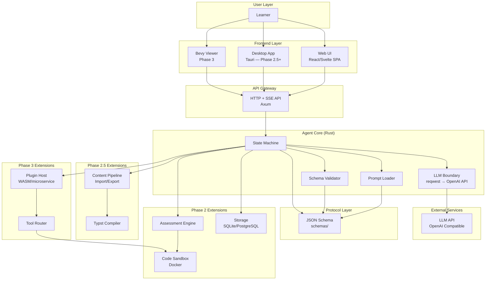

### 3.2 ASCII Architecture Diagram

```
┌──────────────────────────────────────────────────────────────────────────────────┐
│                                   USER LAYER                                     │
└──────────────────────────────────────────────────────────────────────────────────┘
                                      │
        ┌─────────────────────────────┼─────────────────────────────┐
        ▼                             ▼                             ▼
┌───────────────────┐   ┌───────────────────┐   ┌───────────────────┐
│    Web UI (SPA)   │   │  Desktop (Tauri)  │   │   Bevy Viewer     │
│ React/Svelte+Vite │   │    Phase 2.5      │   │     Phase 3       │
│ CodeMirror+KaTeX  │   │                   │   │                   │
└────────┬──────────┘   └────────┬──────────┘   └────────┬──────────┘
         │                       │                       │
         └───────────────────────┼───────────────────────┘
                                 ▼
┌──────────────────────────────────────────────────────────────────────────────────┐
│                          API GATELAYER (HTTP + SSE)                              │
│                         Axum HTTP + SSE Streaming                                │
└──────────────────────────────────────────────────────────────────────────────────┘
                                      │
                                      ▼
┌──────────────────────────────────────────────────────────────────────────────────┐
│                        AGENT CORE (Rust — crates/agent-core)                     │
│  ┌──────────────────────────────────────────────────────────────────────────┐    │
│  │                          STATE MACHINE (FSM)                             │    │
│  │   IDLE → GOAL_INPUT → FEASIBILITY_CHECK → PROFILE_COLLECTION →          │    │
│  │   CURRICULUM_PLANNING → CHAPTER_LEARNING → COMPLETED                    │    │
│  │                          Any state → ERROR                              │    │
│  └──────────────────────────────────────────────────────────────────────────┘    │
│       │              │              │              │                             │
│       ▼              ▼              ▼              ▼                             │
│  ┌─────────┐   ┌──────────┐   ┌──────────┐   ┌──────────┐                     │
│  │ Prompt  │   │   LLM    │   │  Schema  │   │  State   │                     │
│  │ Loader  │   │ Boundary │   │Validator │   │ Storage  │                     │
│  └─────────┘   └──────────┘   └──────────┘   └──────────┘                     │
└──────────────────────────────────────────────────────────────────────────────────┘
                                      │
                                      ▼
┌──────────────────────────────────────────────────────────────────────────────────┐
│                           PROTOCOL LAYER (schemas/)                              │
│  LearningGoal │ FeasibilityResult │ UserProfile │ CurriculumPlan │ Chapter      │
│  Message │ ChapterProgress │ AssessmentSpec │ SourceDocument │ ...              │
└──────────────────────────────────────────────────────────────────────────────────┘
                                      │
           ┌──────────────────────────┼──────────────────────────┐
           ▼                          ▼                          ▼
┌──────────────────┐   ┌──────────────────┐   ┌──────────────────┐
│   Phase 2        │   │   Phase 2.5      │   │   Phase 3        │
│ ┌──────────────┐ │   │ ┌──────────────┐ │   │ ┌──────────────┐ │
│ │   Storage    │ │   │ │   Content    │ │   │ │ Plugin Host  │ │
│ │  Persistent  │ │   │ │  Pipeline    │ │   │ │  WASM/Micro  │ │
│ └──────────────┘ │   │ └──────────────┘ │   │ └──────────────┘ │
│ ┌──────────────┐ │   │ ┌──────────────┐ │   │ ┌──────────────┐ │
│ │ Assessment   │ │   │ │    Typst     │ │   │ │ Tool Router  │ │
│ │   Engine     │ │   │ │   Compiler   │ │   │ │              │ │
│ └──────────────┘ │   │ └──────────────┘ │   │ └──────────────┘ │
│ ┌──────────────┐ │   │                  │   │ ┌──────────────┐ │
│ │   Sandbox    │ │   │                  │   │ │    Bevy      │ │
│ │   Docker     │ │   │                  │   │ │   Renderer   │ │
│ └──────────────┘ │   │                  │   │ └──────────────┘ │
└──────────────────┘   └──────────────────┘   └──────────────────┘
```

---

## 4. Layered Architecture

### 4.1 Layer Diagram

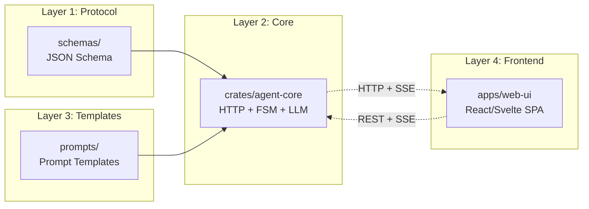

### 4.2 Layer Responsibilities

| Layer | Directory | Responsibility | Phase |
|-------|-----------|----------------|-------|
| **Protocol** | `schemas/` | JSON Schema definitions for all cross-module data contracts | 0–1 |
| **Core** | `crates/agent-core` | HTTP service, state machine, LLM boundary, prompt loading, schema validation | 1 |
| **Templates** | `prompts/` | Versioned LLM prompt templates with structured output requirements | 1 |
| **Frontend** | `apps/web-ui` | Chat window, curriculum sidebar, chapter content area | 1 |
| **Tests** | `tests/` | Integration, contract, E2E, and security tests | 1+ |
| **Tools** | `tools/` | Schema validator, bootstrap, check scripts, developer utilities | 0–1 |
| **Storage** | `crates/storage` | Data persistence (SQLite/PostgreSQL), sessions, progress | 2 |
| **Assessment** | `crates/assessment-engine` | Exercise generation, answer evaluation, grading | 2 |
| **Sandbox** | `sandboxes/` | Docker-based code execution, resource limits, audit logs | 2 |
| **Content** | `crates/content-pipeline` | Import (PDF/text/web), export (Typst/PDF) | 2.5 |
| **Desktop** | `apps/desktop` | Tauri desktop shell, local permissions, import/export | 2.5 |
| **Plugin Host** | `crates/plugin-host` | Plugin lifecycle, permissions, isolation | 3 |
| **Tool Router** | `crates/tool-router` | Tool dispatch, sandbox request routing | 3 |
| **Bevy Renderer** | `apps/bevy-viewer` | Interactive 2D/3D/simulation scenes | 3 |
| **Assets** | `assets/` | Fonts, icons, scene assets, licensed learning materials | 3 |

---

## 5. Phase 0: Repository Foundation

Phase 0 ensures the repository is buildable, checkable, and observable before or alongside early Phase 1 work.

### 5.1 Deliverables

| Deliverable | Description |
|-------------|-------------|
| Bootstrap script | `scripts/bootstrap` — verify Rust, Node, package manager, phase-specific tools |
| Check script | `scripts/check` — run formatters, linters, type checks, schema validation, tests |
| Schema validation | `scripts/schema-check` — validate all JSON Schema files and fixtures |
| Logging policy | Structured logging with `tracing`, redaction rules, no secrets in logs |
| CI plan | Fail on formatting, lint, tests, schema errors, accidental secrets |

### 5.2 Phase 0 Diagram

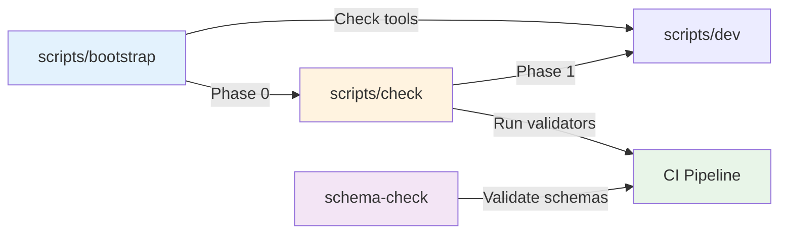

---

## 6. Phase 1: Web Learning Assistant MVP

### 6.1 Deliverables

| Directory | Phase 1 Deliverable |
|-----------|---------------------|
| `schemas/` | JSON Schemas for `LearningGoal`, `FeasibilityResult`, `UserProfile`, `CurriculumPlan`, `Chapter`, `Message`, `ChapterProgress` |
| `crates/agent-core` | Rust HTTP service: Axum, Tokio, Serde, reqwest, tracing, prompt loading, state machine, LLM boundary, schema validation |
| `prompts/` | Versioned templates: `feasibility_check.v1.prompt.md`, `profile_collection.v1.prompt.md`, `curriculum_planning.v1.prompt.md`, `chapter_teaching.v1.prompt.md`, `question_answering.v1.prompt.md` |
| `apps/web-ui` | React/Svelte SPA with chat, curriculum sidebar, chapter content area, Markdown, KaTeX, CodeMirror 6 |
| `tests/` | Integration tests for core learning flow, HTTP API, SSE behavior, schema validation, state machine transitions |
| `tools/` | Schema validation tool or script |

### 6.2 Phase 1 Component Diagram

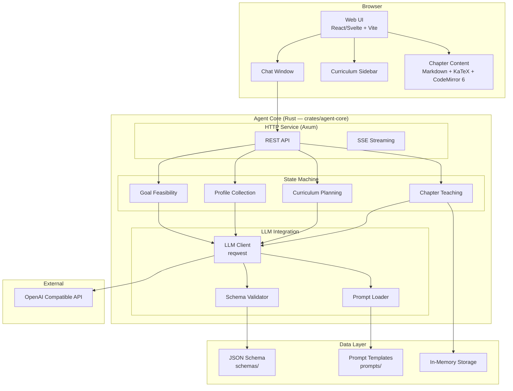

### 6.3 Phase 1 Data Model

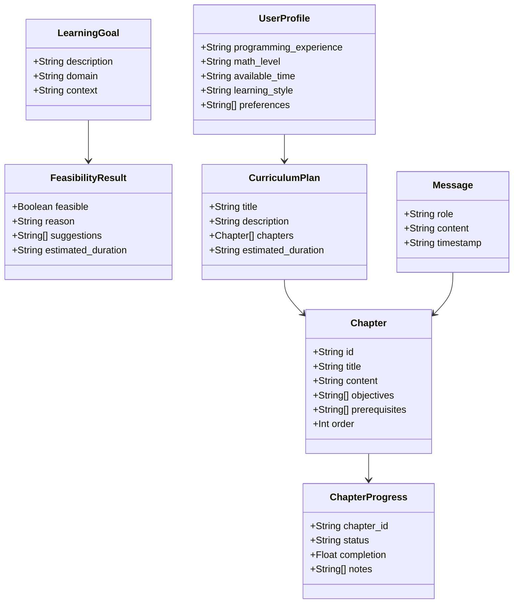

### 6.4 Phase 1 File Structure

```text
blup/
├── schemas/
│   ├── learning_goal.v1.schema.json
│   ├── feasibility_result.v1.schema.json
│   ├── user_profile.v1.schema.json
│   ├── curriculum_plan.v1.schema.json
│   ├── chapter.v1.schema.json
│   ├── message.v1.schema.json
│   └── chapter_progress.v1.schema.json
│
├── crates/
│   └── agent-core/
│       ├── Cargo.toml
│       └── src/
│           ├── main.rs
│           ├── api/
│           │   ├── mod.rs
│           │   ├── routes.rs
│           │   └── handlers.rs
│           ├── state/
│           │   ├── mod.rs
│           │   └── machine.rs
│           ├── llm/
│           │   ├── mod.rs
│           │   └── client.rs
│           ├── prompts/
│           │   ├── mod.rs
│           │   └── loader.rs
│           └── models/
│               ├── mod.rs
│               └── types.rs
│
├── prompts/
│   ├── feasibility_check.v1.prompt.md
│   ├── profile_collection.v1.prompt.md
│   ├── curriculum_planning.v1.prompt.md
│   ├── chapter_teaching.v1.prompt.md
│   └── question_answering.v1.prompt.md
│
├── apps/
│   └── web-ui/
│       ├── package.json
│       └── src/
│           ├── App.tsx
│           ├── components/
│           │   ├── Chat.tsx
│           │   ├── Sidebar.tsx
│           │   └── Content.tsx
│           ├── services/
│           │   └── api.ts
│           └── types/
│               └── index.ts
│
├── tests/
│   ├── integration/
│   │   ├── learning_flow_test.rs
│   │   ├── api_test.rs
│   │   └── sse_test.rs
│   └── contract/
│       └── schema_validation_test.rs
│
├── tools/
│   └── schema-validator/
│       └── src/main.rs
│
└── scripts/
    ├── bootstrap
    ├── dev
    ├── check
    └── schema-check
```

### 6.5 Phase 1 API Contract

| Method | Path | Purpose | Body | Response |
|--------|------|---------|------|----------|
| `POST` | `/api/session` | Create a learning session | — | `{ "session_id": "uuid", "state": "IDLE" }` |
| `POST` | `/api/session/{id}/goal` | Submit a learning goal | `LearningGoal` | SSE stream with `FeasibilityResult` |
| `POST` | `/api/session/{id}/profile/answer` | Submit a profile answer | `{ "question_id": "...", "answer": "..." }` | SSE stream with next question or `UserProfile` |
| `GET` | `/api/session/{id}/curriculum` | Get the curriculum | — | `CurriculumPlan` |
| `GET` | `/api/session/{id}/chapter/{ch_id}` | Start/continue chapter teaching | — | SSE stream with chapter content |
| `POST` | `/api/session/{id}/chapter/{ch_id}/ask` | Ask a question in a chapter | `{ "question": "..." }` | SSE stream with `Message` |
| `POST` | `/api/session/{id}/chapter/{ch_id}/complete` | Mark chapter complete | — | `ChapterProgress` |

**Error response format:**

```json
{ "error": { "code": "string", "message": "string" } }
```

### 6.6 SSE Event Contract

| Event | Purpose | Data |
|-------|---------|------|
| `chunk` | Streamed LLM text | `{ "content": "string", "index": number }` |
| `status` | State or step status | `{ "state": "string", "message": "string" }` |
| `error` | Recoverable or fatal error | `{ "code": "string", "message": "string" }` |
| `done` | Step completion | `{ "result": <SchemaType> }` |
| `ping` | Keepalive every 15 seconds | `{}` |

**Reconnect:** The server keeps a bounded replay buffer and supports `Last-Event-ID`.

---

## 7. Data Flow

### 7.1 End-to-End Sequence

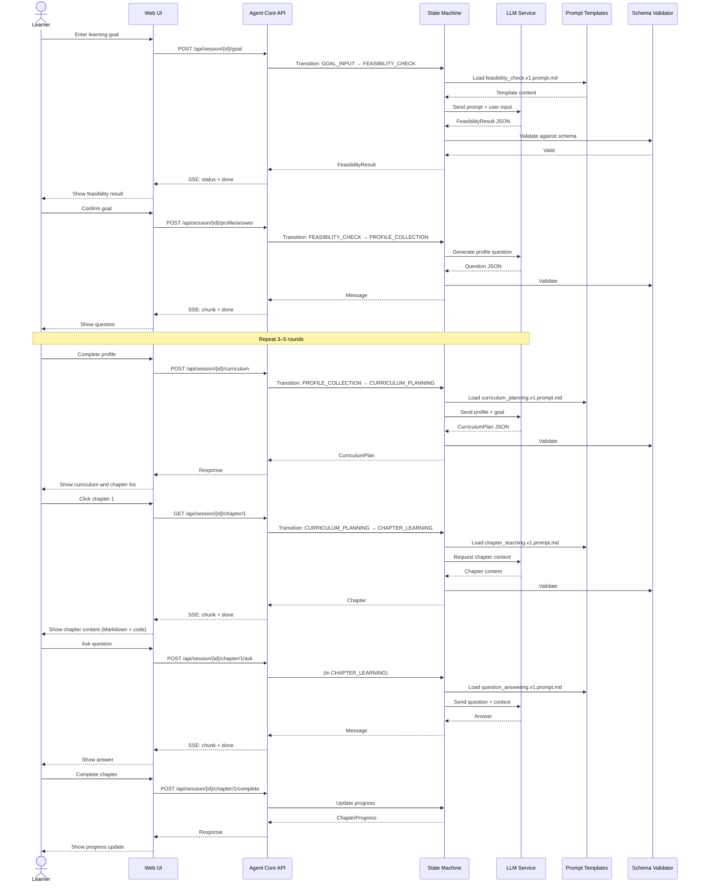

---

## 8. State Machine

### 8.1 State Diagram

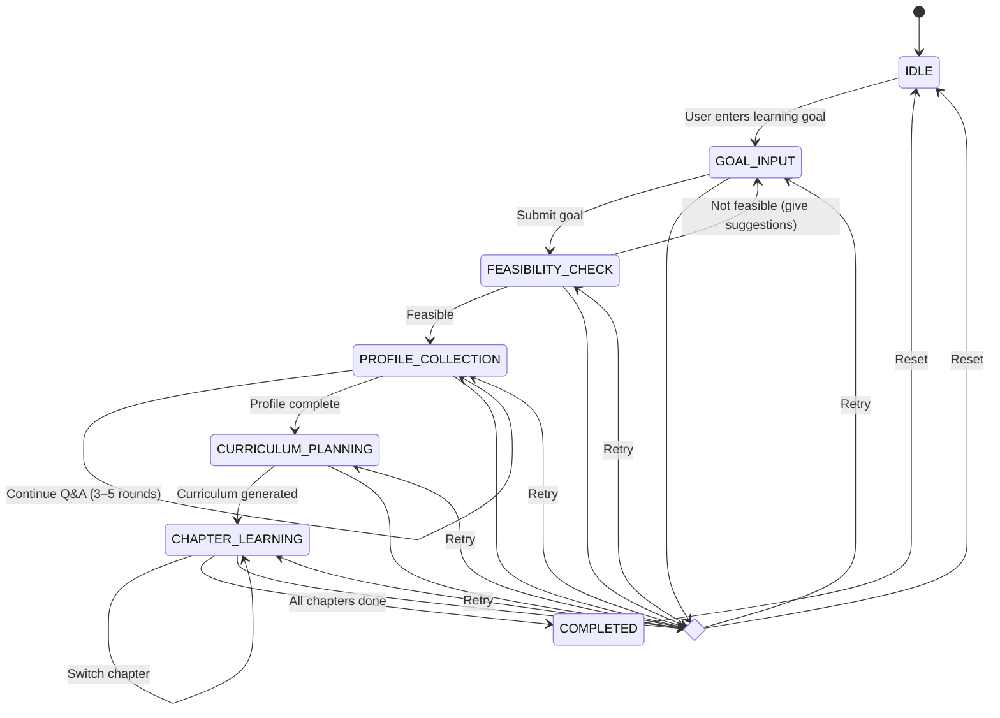

### 8.2 State Descriptions

| State | Description | Valid Transitions |
|-------|-------------|-------------------|
| `IDLE` | Initial/reset state | → `GOAL_INPUT` |
| `GOAL_INPUT` | Waiting for user to enter learning goal | → `FEASIBILITY_CHECK` / `ERROR` |
| `FEASIBILITY_CHECK` | LLM determines goal feasibility | → `PROFILE_COLLECTION` (feasible) / `GOAL_INPUT` (adjust) / `ERROR` |
| `PROFILE_COLLECTION` | 3–5 rounds of profile Q&A | → `CURRICULUM_PLANNING` / `ERROR` |
| `CURRICULUM_PLANNING` | Generate personalized learning path | → `CHAPTER_LEARNING` / `ERROR` |
| `CHAPTER_LEARNING` | Chapter teaching dialogue (switch chapters, ask questions) | → `COMPLETED` / `ERROR` |
| `COMPLETED` | All chapters completed | → `IDLE` |
| `ERROR` | Error state | → Previous state (retry) / `IDLE` (reset) |

### 8.3 State Machine Rules

- A session has exactly one active state transition at a time.
- Phase 1 may store state in memory or JSON files; Phase 2 moves to SQLite/PostgreSQL.
- Disconnected clients resume by `session_id`.
- Invalid transitions must return structured errors and must be tested.

---

## 9. Module Dependencies

### 9.1 Full Dependency Graph

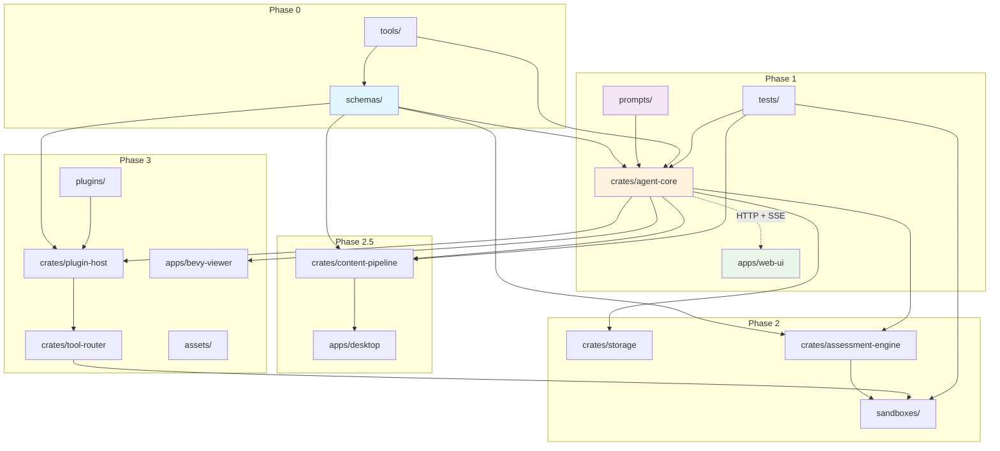

### 9.2 Phase 1 Build Order

```mermaid
graph LR
    S[schemas/] -->|1. Define contracts| AC[crates/agent-core]
    AC -->|2. Implement core| P[prompts/]
    P -->|3. Configure templates| W[apps/web-ui]
    W -->|4. Build frontend| TEST[tests/]
    TEST -->|5. Verify| DONE[✓ MVP Complete]

    style S fill:#e1f5fe
    style AC fill:#fff3e0
    style P fill:#f3e5f5
    style W fill:#e8f5e8
    style TEST fill:#fce4ec
    style DONE fill:#c8e6c9
```

---

## 10. Crate Evolution

### 10.1 Crate Split Diagram

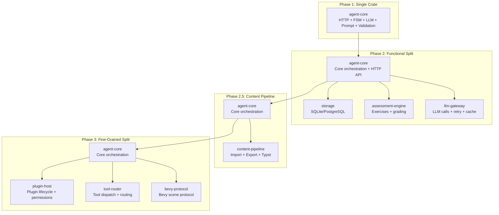

### 10.2 Crate Dependency Tree (Phase 3)

```text
schemas (no dependencies)
  ↓
agent-core → storage
  ↓           ↓
  ↓       assessment-engine
  ↓           ↓
  llm-gateway → content-pipeline
  ↓
  plugin-host → tool-router
  ↓
  bevy-protocol (independent leaf crate, depends only on schemas)
```

### 10.3 Crate Descriptions

| Crate | Phase | Responsibility |
|-------|-------|----------------|
| `agent-core` | 1 | Core orchestration, state machine, HTTP API, LLM boundary, validation |
| `storage` | 2 | Persistent database access (SQLite/PostgreSQL via SQLx), sessions, progress |
| `assessment-engine` | 2 | Exercise generation, answer evaluation, grading logic |
| `llm-gateway` | 2 | LLM call abstraction, retry, caching, multi-model support |
| `content-pipeline` | 2.5 | Import (PDF/text/web), export (Typst/PDF), source document management |
| `plugin-host` | 3 | Plugin lifecycle, permissions, isolation (WASM or microservice) |
| `tool-router` | 3 | Tool dispatch, sandbox request routing |
| `bevy-protocol` | 3 | Bevy scene protocol, off-screen rendering, texture sharing |

---

## 11. Technology Stack

### 11.1 Technology Stack Diagram

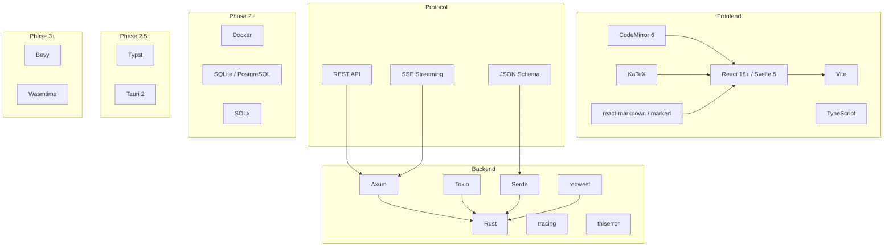

### 11.2 Technology Stack Table

| Layer | Technology | Purpose | Phase |
|-------|------------|---------|-------|
| **Frontend** | React 18+ / Svelte 5 | UI framework | 1 |
| | Vite | Build tool | 1 |
| | CodeMirror 6 | Code editor, syntax highlighting (~200KB) | 1 |
| | KaTeX | Math formula rendering | 1 |
| | react-markdown / marked | Markdown rendering | 1 |
| | TypeScript | Type safety | 1 |
| **Backend** | Rust | Core language | 1 |
| | Axum | HTTP framework | 1 |
| | Tokio | Async runtime | 1 |
| | Serde | Serialization/deserialization | 1 |
| | reqwest | HTTP client (LLM calls) | 1 |
| | tracing | Logging and tracing | 1 |
| | thiserror | Error handling | 1 |
| **Protocol** | REST API | HTTP request/response | 1 |
| | SSE | Server-Sent Events (streaming) | 1 |
| | JSON Schema | Data validation | 1 |
| **Persistence** | SQLite / PostgreSQL | Database | 2 |
| | SQLx | Database access | 2 |
| **Sandbox** | Docker | Isolated code execution | 2 |
| **Export** | Typst | Document compilation (Typst → PDF) | 2.5 |
| **Desktop** | Tauri 2 | Desktop application framework | 2.5 |
| **Rendering** | Bevy | Game engine / interactive scenes | 3 |
| **Plugins** | Wasmtime | WASM runtime | 3 |

---

## 12. Evolution Roadmap

### 12.1 Timeline

```mermaid
timeline
    title Blup Architecture Evolution Roadmap
    section Phase 0: Foundation
        Repository bootstrap and observability
        : scripts/bootstrap
        : scripts/check
        : scripts/schema-check
        : Logging policy
        : CI plan
    section Phase 1: MVP
        Single-user web learning assistant
        : schemas/ — 7 JSON Schemas
        : crates/agent-core — Rust HTTP service
        : prompts/ — 5 prompt templates
        : apps/web-ui — React/Svelte SPA
        : tests/ — integration tests
        : tools/ — schema validator
    section Phase 2: Verification & Persistence
        Exercises, assessment, sandboxed execution
        : crates/storage — SQLite/PostgreSQL
        : crates/assessment-engine — exercises + grading
        : crates/llm-gateway — LLM abstraction
        : sandboxes/ — Docker sandbox
        : tests/ — sandbox + assessment tests
    section Phase 2.5: Desktop & Materials
        Desktop packaging, import, export
        : apps/desktop — Tauri shell
        : crates/content-pipeline — import + export
        : tools/typst-export — PDF compilation
        : tools/content-importer — PDF/text/web
    section Phase 3: Extensions & Scenes
        Plugins and interactive scenes
        : plugins/ — domain-specific extensions
        : crates/plugin-host — plugin lifecycle
        : crates/tool-router — tool dispatch
        : apps/bevy-viewer — Bevy renderer
        : assets/ — scene assets
```

### 12.2 Deliverables Per Phase

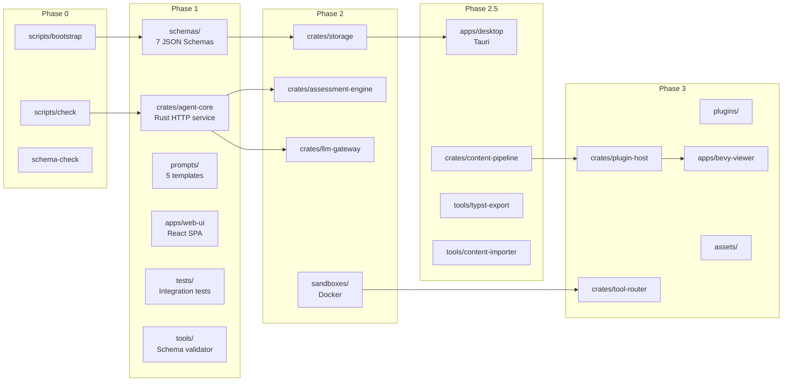

---

## 13. Key Constraints

### 13.1 Global Constraints (All Phases)

| Constraint | Description |
|------------|-------------|
| **No logic in frontend** | Do not put all logic into the frontend |
| **LLM must not fake results** | Do not let LLMs pretend to execute deterministic work (calculation, compilation, testing) |
| **Privacy by design** | Do not commit or log API keys, tokens, credentials, private user data, imported private materials, or generated user artifacts |
| **Sandbox execution** | Do not run user-submitted code on the host without a sandbox (Phase 2+) |
| **Plugin isolation** | Do not load third-party plugins without permission boundaries (Phase 3+) |
| **No direct LLM calls from UI** | UI code must never call LLM providers directly |
| **Validate LLM output** | Core must validate LLM structured output before using it |
| **Bevy is not primary UI** | The Web UI renders the primary learning product; Bevy is an interactive rendering layer |

### 13.2 Phase 0 Constraints

| Required |
|----------|
| Documented bootstrap command that checks required local tooling |
| Documented check command that runs formatters, linters, type checks, schema validation, tests |
| Schema validation path for all JSON Schema files and fixtures |
| Logging and redaction policy before adding LLM calls |
| CI plan that fails on formatting, lint, tests, schema errors, accidental secrets |

### 13.3 Phase 1 Constraints

| Forbidden | Allowed |
|-----------|---------|
| Introducing Bevy, Tauri, WASM, Docker dependencies | Using in-memory storage or JSON files |
| UI layer calling LLM API directly | Prompt templates inline during debugging (must mark `TODO: extract to prompts/`) |
| Running user-submitted code | agent-core and web-ui running on same machine |

### 13.4 Phase 2 Constraints

| Forbidden |
|-----------|
| Running user code on the host without sandbox |
| Sandbox defaulting to network access |
| Running tasks without timeout and resource limits |

### 13.5 Phase 3 Constraints

| Forbidden |
|-----------|
| Plugins bypassing Core for final learning progress |
| Plugins directly accessing files, network, secrets, databases, or other plugins |
| Depending on unstable WASM Component Model details until ADR accepts the risk |

---

## 14. Glossary

| Term | Description |
|------|-------------|
| **Agent Core** | Rust-implemented core orchestration service |
| **FSM** | Finite State Machine, manages dialogue flow |
| **Schema** | JSON Schema, data structure definition |
| **SSE** | Server-Sent Events, server-push streaming |
| **WASM** | WebAssembly, used for plugin isolation |
| **LLM** | Large Language Model (GPT, Claude, etc.) |
| **Typst** | Modern typesetting system used for PDF export |
| **Tauri** | Desktop application framework (Phase 2.5+) |
| **Bevy** | Rust game engine for interactive scenes (Phase 3) |
| **Wasmtime** | WASM runtime for plugin execution (Phase 3) |

---

## Appendix: Related Documents

- [AGENTS.md](../AGENTS.md) — Canonical planning and agent-instruction document
- [schemas/AGENTS.md](../schemas/AGENTS.md) — Schema module rules
- [crates/AGENTS.md](../crates/AGENTS.md) — Crate module rules
- [prompts/AGENTS.md](../prompts/AGENTS.md) — Prompt module rules
- [apps/AGENTS.md](../apps/AGENTS.md) — Application module rules
- [tests/AGENTS.md](../tests/AGENTS.md) — Testing module rules
- [tools/AGENTS.md](../tools/AGENTS.md) — Tools module rules
- [sandboxes/AGENTS.md](../sandboxes/AGENTS.md) — Sandbox module rules
- [plugins/AGENTS.md](../plugins/AGENTS.md) — Plugin module rules
- [assets/AGENTS.md](../assets/AGENTS.md) — Asset module rules
- [docs-internal/AGENTS.md](./AGENTS.md) — Internal documentation rules